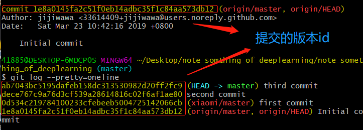
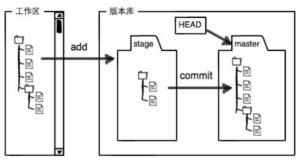
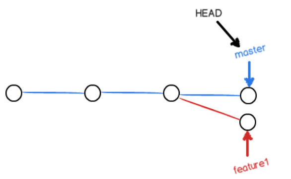
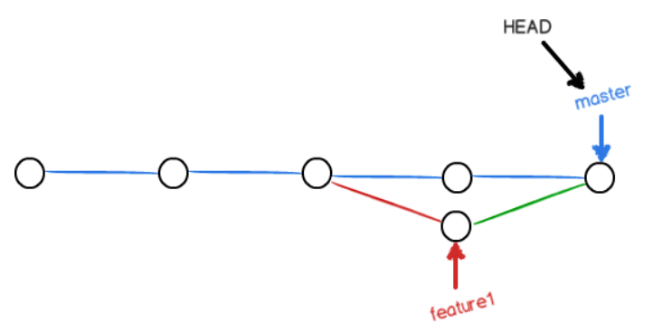
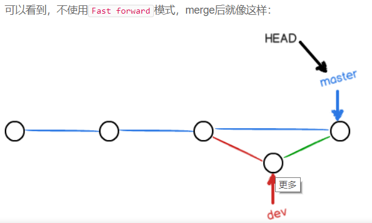

[原文网址][1]
## 版本库
#### 又名仓库，repository，可以简单理解为一个目录。
### 创建版本库，选择一个合适的地方，创建一个空目录 learngit 为仓库名
+ mkdir learngit
+ cd learngit
+ pwd -- 查看当前目录
### 通过git init 将该目录变成Git可以管理的仓库，初始化仓库
+ git init

### 将文件添加到版本库
<big>**版本控制系统可以告诉你每次的改动，但没法跟踪文件的变化**</big>
#### 1 用命令git add 把文件添加到仓库，该文件在创建的仓库下
+ git add readme.txt

#### 2 用命令git commit 把文件提交到仓库
+ git commit -m "wrote a readme file"

### git status 命令可以让我们时刻掌握仓库当前的状态
+ git status

### git diff 查看文件修改内容
+ git diff readme.txt

**<big>每当你觉得文件修改到一定程度的时候，就可以“保存一个快照”，这个快照被称为 ***commit*** </big>**。
一旦你把文件改乱了，或者误删了文件，还可以从最近的一个commit恢复。

### 查看最近到最远的提交日志
+ git log
+ + 嫌输出信息太多，可加如下参数
+ + git log --pretty=oneline
+ 
+ HEAD表示当前版本
+ HEAD^表示上一个版本
+ HEAD^^表示上上个版本
+ 把版本回到上一个版本
+ + git reset --hard HEAD^
+ 回到将来版本，需要你的bash窗口没关闭
+ git reset --hard 1094
+ + 版本号没必要写全

### Git 记录你的每次命令
+ git reflog

### 工作区和暂存区
#### 工作区
+ 电脑上的目录，比如我们创建的工作目录就是一个工作区

#### 版本库Repository
+ 工作区有一个隐藏目录.git，这个不算工作区，而是Git的版本库
+ 版本库里存了很多东西，其中最重要的时stage/index的暂存区，还有Git为我们自动创建的第一个分支master，以及只想master的一个指针HEAD，，，如下图
+ + 
+ git add 把文件修改添加添加到暂存区
+ git commit 把暂存区的所有内容提交到当前分支

### Git跟踪并管理的是修改，而非文件
+ 每次修改，如果不用git add 到暂存区，那就不会加入到commit中

### 丢弃工作区的修改
+ git checkout -- readme.txt
+ 让这个文件回到最近一次git commit 或 git add时的状态
+ git reset 命令既可以回退版本，也可以把暂存区的修改回退到工作区
+ + git reset HEAD readme.txt

### 可以版本回退到上一个版本，不过条件是好没有把自己的本地版本库推送到远程。

### 删除文件
+ 当rm删除工作区的文件后
+ + 1.确实要从版本库中删除该文件，用git rm 删掉，并且 git commit
+ + 2.删错了，因为版本库还有 git checkout -- test.txt

### 把一个已有的本地仓库与远程仓库关联，在本地仓库运行
+ git remote add origin git@github.com:用户名/远程仓库名.git
+ 远程库名字origin
+ 把本地库所有内容推送到远程库
+ git push -u origin
+ 把本地库内容推送到远程，用git push命令，实际上是把当前分支master推送到远程
+ 由于远程库是空的，我们第一次推送master分支时，加上了-u参数，Git不但会把本地的master分支内容推送的远程新的master分支，还会把本地的master分支和远程的master分支关联起来，在以后的推送或者拉取时就可以简化命令。
+ 之后，子要本地做了提交，就可以git push origin master 把本地master分支的最新修改推送到github上。

### 从远程库克隆
+ git clone git@github.com.用户名/项目名/仓库名.git
+ https 协议除了速度慢，还有个最大的麻烦时每次推送都必须输入口令

### 分支管理
当我们创建新的分支，例如dev ，Git新建了一个指针叫dev，只想master相同的提交，在把HEAD指向dev，就表示当前分支在dev上。
+ 创建dev分支，然后切换到dev分支
+ + git checkout -b dev
+ -b参数表示创建并切换，相当于如下两条命令
+ + git branch dev
+ + git checkout dev
#### 查看当前分支
+ git branch
+ 会列出所有分支，当前分支前面会标一个*号
#### 合并分支到master，前提时要切回到master
+ git checkout master
+ git merge dev
+ git merge 合并指定分支到当前分支
#### 删除分支
+ git branch -d dev

### 合并分支，如下图

+ git status 可以告诉我们冲突文件
+ 修改该文件后
+ 再 git add readme.txt
+ git commit -m "ssss"
+ 之后情况如下图：
+ + 
#### git log 可以看到分支合并情况
+ git log --graph --pretty=oneline --abbrev-commit
+ git log --graph 查看分支合并图

### 不使用Fast forward合并分支
+ git merge --no-ff -m "merge with no-ff" dev
+ -m 代表合并要创建一个新的commit
+ git log 查看分支历史
+ + 

### Bug分支
+ git stash
+ 可以把当前工作现场储藏起来，等以后恢复现场后继续工作
+ git stash list 查看原来的工作现场去哪了
+ 恢复指定的stash
+ + git stash apply stash@{0}
+ + git stash drop 删除stash内容
+ 恢复的同时删除stash内容
+ + git stash pop

### 如果要丢弃一个没有被合并过的分支，可以通过
+ git branch -D <name>强行删除。

### 推送分支
+ git push origin master
+ git push [远程库分支] [本地分支]
+ + master分支是主分支，因此要时刻与远程同步
+ + dev分支是开发分支，团队所有成员都需要在上面工作，所以也需要与远程同步；
+ + bug分支只用于在本地修复bug，就没必要推到远程了，除非老板要看看你每周到底修复了几个bug；
+ + feature分支是否推到远程，取决于你是否和你的小伙伴合作在上面开发。

### 抓取分支
当其他队友从远程库clone项目，只能看到本地分支，若想在dev分支上开发，就必须创建远程origin的dev分支到本地，
+ git checkout -b dev origin/dev

当其他队友同时push，推送失败，因为你的小伙伴的最新提交和你视图推送的提交有冲突，先用git pull 把最新的提交从roigin/dev 抓取下来，然后，再本地合并，解决冲突，再推送
+ git pull

git pull 也失败的化，原因时没有指定本地dev分支与远程origin/dev分支的链接，
+ git branch --set-upstream-to=origin/dev dev
再pull

### rebase 操作可以把本地未push的分支提交历史整理成直线
### rebase 目的是使得我们再查看历史提交得变化时更容易，因为分叉得提交需要三方对比

### git tag<name> 可以打标签
+ git tag v1.0
打在当前分支上，默认标签时是打在最新提交得commit上
+ git tag
+ 查看所有标签
+ + 命令git tag <tagname>用于新建一个标签，默认为HEAD，也可以指定一个commit id
+ + 命令git tag -a <tagname> -m "blablabla..."可以指定标签信息
+ + 命令git tag可以查看所有标签
###### 注意：标签总是和某个commit挂钩。如果这个commit既出现在master分支，又出现在dev分支，那么在这两个分支上都可以看到这个标签。

[1]: https://www.liaoxuefeng.com/wiki/0013739516305929606dd18361248578c67b8067c8c017b000/001375840038939c291467cc7c747b1810aab2fb8863508000
